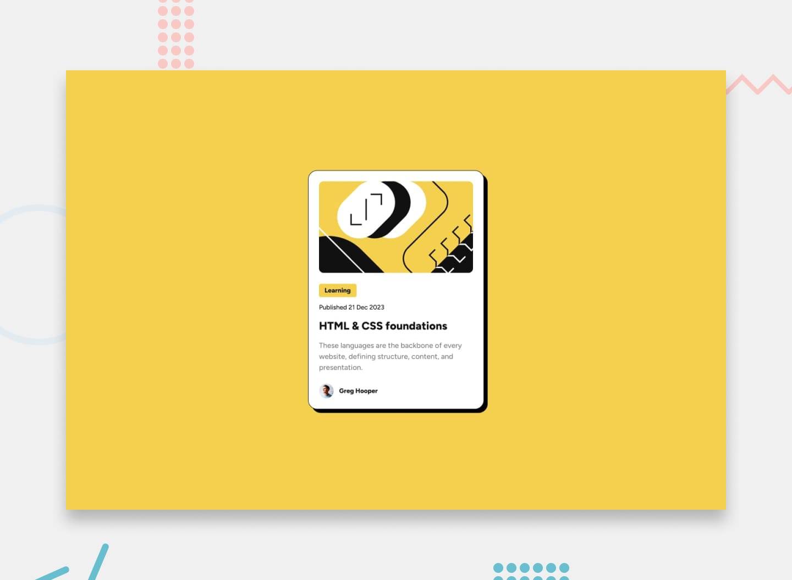

# Frontend Mentor - Blog preview card solution

This is a solution to the [Blog preview card challenge on Frontend Mentor](https://www.frontendmentor.io/challenges/blog-preview-card-ckPaj01IcS). Frontend Mentor challenges help you improve your coding skills by building realistic projects.

## Table of contents

- [Overview](#overview)
    - [The challenge](#the-challenge)
    - [Screenshot](#screenshot)
    - [Links](#links)
- [My process](#my-process)
    - [Built with](#built-with)
    - [What I learned](#what-i-learned)
    - [Continued development](#continued-development)
    - [Useful resources](#useful-resources)
    - [AI collaboration](#ai-collaboration)
- [Author](#author)
- [Acknowledgments](#acknowledgments)

## Overview

### The challenge

Users should be able to:

- See hover and focus states for all interactive elements on the page

### Screenshot

Add a `screenshot.jpg` in the project root (or update the path above) after you capture your solution.

### Links

- Solution URL: [Github Repo](https://github.com/Vladislav2397/challenge__blog-preview-card)
- Live Site URL: [GitHub Pages](https://vladislav2397.github.io/challenge__blog-preview-card/)

## My process

### Built with

- Semantic HTML5 (`<main>`, `<article>`, `<time>`, etc.)
- [CSS custom properties](https://developer.mozilla.org/en-US/docs/Web/CSS/Using_CSS_custom_properties) for colors, spacing, and typography scale
- [Flexbox](https://developer.mozilla.org/en-US/docs/Web/CSS/CSS_flexible_box_layout) for page centering, card layout, and author row
- Mobile-first layout with a `min-width: 450px` breakpoint for type and cover image ratio
- Local [Figtree](https://fonts.google.com/specimen/Figtree) fonts via `@font-face` (`Figtree-Medium`, `Figtree-ExtraBold`)
- A [CSS reset](https://developer.mozilla.org/en-US/docs/Learn/CSS/Building_blocks/Cascade_and_inheritance#reset_styling) (`reset.css`) before project styles

### What I learned

Structuring the card as an `<article>` keeps the blog preview meaningful for assistive tech and SEO. Using design tokens in `:root` (colors, `--spacing-*`, font presets) makes the stylesheet easier to adjust when matching the design. Flexbox with `gap` avoided fragile margins between the tag, date, title link, description, and author block.

### Continued development

- Strengthen keyboard UX with visible `:focus-visible` styles on the title link and footer links
- Fine-tune spacing and shadows against the design file on more breakpoints if needed

### Useful resources

- [MDN: Flexbox](https://developer.mozilla.org/en-US/docs/Web/CSS/CSS_flexible_box_layout/Basic_concepts_of_flexbox) — layout fundamentals used throughout this page
- [MDN: `aspect-ratio`](https://developer.mozilla.org/en-US/docs/Web/CSS/aspect-ratio) — consistent cover image proportions across viewports

### AI collaboration

(Optional) Describe any AI tools you used while building or documenting this project—what helped and what you verified manually.

## Author

- Website — [Your name or portfolio](https://example.com)
- Frontend Mentor — [@Vladislav2397](https://www.frontendmentor.io/profile/@Vladislav2397)

Replace the footer “Coded by” link in `index.html` when you publish your name or site.

## Acknowledgments

Thanks to [Frontend Mentor](https://www.frontendmentor.io) for the challenge assets and brief.
